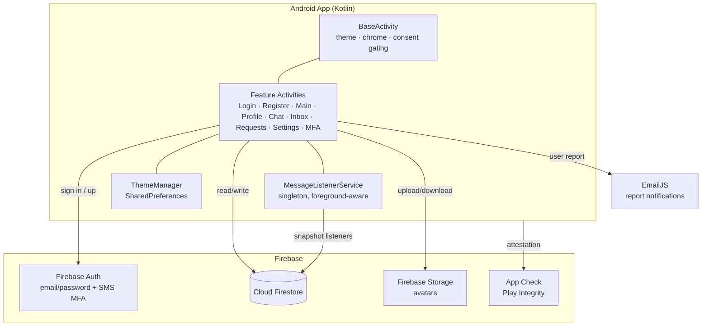

# Architecture Overview — Skills United

This document describes how Skills United is put together: the client structure, the Firestore data model, the real-time messaging and notification design, the theming engine, and the security model.

---

## High-level system



---

## Client structure

### The `BaseActivity` pattern
Every screen extends `BaseActivity`, which centralises cross-cutting concerns:

- **Theming** — applies the active theme to the view tree on every `onResume`.
- **Navigation chrome** — programmatically injects the settings (gear) and inbox (chat-bubble) icons into the layout root. Screens that shouldn't show them (`LoginActivity`, `RegisterActivity`, `SettingsActivity`, `InboxActivity`) override the relevant `protected open` hooks.
- **Consent gating** — `checkTermsAccepted { ... }` wraps protected screens and blocks access until the Terms of Service have been accepted. Acceptance state lives in `SharedPreferences` and is cleared on logout.

### Activities
| Activity | Responsibility |
|---|---|
| `LoginActivity` | Email sign-in, MFA challenge entry, terms link |
| `RegisterActivity` | Account creation, validation, unique-username reservation |
| `MainActivity` | Browse/search members; one-time `userChats` migration |
| `ProfileActivity` | Edit own bio + skills (programmatic views, see below) |
| `UserProfileActivity` | View another member, start a conversation |
| `ChatActivity` | Real-time 1:1 messaging (`FLAG_SECURE`) |
| `InboxActivity` | Live conversation list with unread state |
| `MatchRequestActivity` | Send/respond to connection requests |
| `SettingsActivity` | Theme presets + colour-wheel customisation |
| `MfaEnrollmentActivity` / `MfaSignInActivity` | SMS MFA enrol / challenge |

### Supporting classes
- `ThemeManager` — singleton; stores 8 colour roles + presets in `SharedPreferences`.
- `MessageListenerService` — singleton real-time notification driver.
- `MessageAdapter` / `Message` — chat list adapter and message model.
- `TermsDialogHelper` — Terms-of-Service presentation/acceptance.
- `AvatarView` — custom view rendering colour-seeded avatars.
- `EmailService` — dispatches report notifications via EmailJS over OkHttp.

---

## Data model (Cloud Firestore)

```
users/{uid}
  ├── displayName, username, bio
  ├── skillsToTeach: []      (browsable / "published")
  ├── skillsToLearn: []
  └── avatarUrl

usernames/{username}         ← uniqueness index
  └── uid                     (reserved via atomic batch write with users/{uid})

matchRequests/{requestId}
  ├── fromUid, toUid
  └── status                  (pending / accepted / declined)

chats/{chatId}/messages/{messageId}
  ├── senderId
  ├── text                    (sanitised, length-capped)
  └── timestamp
  # chatId = min(uidA,uidB)_max(uidA,uidB)

userChats/{uid}
  ├── chatIds: []
  └── lastRead_{chatId}        (per-conversation read timestamp → unread state)

reports/{reportId}
  └── reportedUid, reporterUid, reason, timestamp
```

### Required composite indexes (`firestore.indexes.json`)
- Collection group `messages`: `timestamp` desc
- Collection group `messages`: `senderId` asc + `timestamp` desc
- `matchRequests`: `toUid` asc + `status` asc
- `matchRequests`: `fromUid` asc + `toUid` asc
- `matchRequests`: `fromUid` asc + `status` asc

---

## Real-time messaging

- **Deterministic chat IDs.** `chatId = min(uidA,uidB)_max(uidA,uidB)`. Both participants derive the same ID with no lookup, so opening, listening to, and securing a conversation needs no coordination.
- **Snapshot listeners.** `ChatActivity` attaches a Firestore snapshot listener to `chats/{chatId}/messages` ordered by `timestamp`, so new messages render instantly.
- **Sanitisation.** Message text is HTML-stripped and length-capped (1000 chars) before write.

---

## Notifications

`MessageListenerService` is a **singleton** started once at login and stopped only at logout:

- It listens to the message subcollections for the user's conversations.
- Its `onNewMessage` callback is **rebound to the currently-resumed activity**, so the in-app banner always appears on the screen the user is viewing.
- Unread counts surface as a red badge on the inbox icon, computed against the `lastRead_{chatId}` timestamps in `userChats/{uid}`.

This avoids both duplicate listeners and missed notifications during navigation.

---

## Theming engine

- `ThemeManager` persists **8 colour roles** — primary, secondary, background, surface, textPrimary, textSecondary, bubbleSent, bubbleReceived.
- **4 presets:** Light, Dark, Forest, Sunset.
- On `onResume`, the active theme is walked over the view tree (`applyThemeToRoot()`), with per-activity `applyTheme()` for fine-grained control.
- A colour-wheel picker (ColorPickerView) lets users set any role live, without an app restart.

---

## Security model

| Control | Where |
|---|---|
| Per-user read/write access, validation functions, rate limiting | Firestore security rules |
| Conversation access limited to participants | Firestore rules (`fromUid`/`toUid` checks) |
| Input validation (name, email, password complexity, username) | Client **and** rules |
| Message sanitisation (HTML strip, length cap) | Client before write |
| HTTPS-only | `network_security_config.xml` |
| Screenshot prevention (`FLAG_SECURE`) | `ChatActivity`, `ProfileActivity` |
| Request attestation | Firebase App Check (Play Integrity) |
| Second factor | Optional SMS MFA |
| Release obfuscation/shrinking | ProGuard |

---

## Notable engineering decisions

- **Programmatic profile skill views.** A `RecyclerView` clipped/collapsed its rows when the keyboard opened on Android 15; replaced with programmatic `LinearLayout` rows inside a `ScrollView` for reliable rendering.
- **Direct inbox reads.** Querying the `chats` collection returned empty under certain conditions; the inbox instead derives chat IDs and reads each conversation directly with live listeners.
- **Atomic username reservation.** Username uniqueness is guaranteed by writing `usernames/{username}` and `users/{uid}` in a single batch — no race window.
